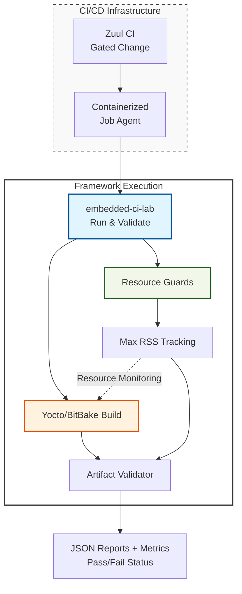

# embedded-ci-lab


`embedded-ci-lab` is a Python-based framework designed for building reliable, observable CI automation for embedded Linux and Yocto build workflows.

## Table of Contents

- [Yocto/BitBake Integration](#yoctobitbake-integration)
- [Portfolio Highlights](#portfolio-highlights)
- [Motivation](#motivation)
- [Features](#features)
- [Getting Started](#getting-started)
- [Usage](#usage)
- [CI/CD Integration Concept](#cicd-integration-concept)
- [Local Development & CI](#local-development--ci)
- [Engineering Decisions](#engineering-decisions)
- [Project structure](#project-structure)
- [Future Work](#future-work)

## Yocto/BitBake Integration

> **Engineering Note:** To demonstrate how `embedded-ci-lab` manages real-world build metadata, I developed a companion repository, [yocto-lab](https://github.com/antoniooreany/yocto-lab), which serves as a hands-on learning sandbox for Yocto/BitBake.

### Setup & Prerequisites

For the integration demos to work out-of-the-box, ensure both repositories are cloned in the same parent directory:

```text
/projects/
├── embedded-ci-lab/
└── yocto-lab/
```

**Portability**: While demos use `../yocto-lab` as a default, the framework is environment-agnostic. You can override the target directory using the `ARTIFACTS_ROOT` environment variable (e.g., `ARTIFACTS_ROOT=/custom/path`). Our pipeline loader natively supports Bash-style variable expansion with defaults: `${ARTIFACTS_ROOT:-../yocto-lab}`.

### Real-world Yocto Build Guide

While the default integration scenarios use mocked artifacts for portability, you can use `embedded-ci-lab` to orchestrate real Yocto builds.

### Prerequisites

To set up the integrated environment, follow these steps in your Linux/WSL2 terminal:

1. **Workspace**: Create a dedicated workspace and clone this orchestrator repository:
   ```bash
   mkdir -p ~/yocto-work && cd ~/yocto-work
   git clone https://github.com/antoniooreany/embedded-ci-lab.git
   ```

2. **Poky**: Clone the Yocto Project reference distribution into the same workspace and switch to a stable release branch (e.g., `scarthgap`):
   ```bash
   cd ~/yocto-work
   git clone https://git.yoctoproject.org/git/poky
   cd poky
   git checkout scarthgap
   ```

3. **Yocto Lab**: Clone the companion metadata repository:
   ```bash
   cd ~/yocto-work
   git clone https://github.com/antoniooreany/yocto-lab.git
   ```

4. **Dependencies**: Install required system packages for BitBake:
   ```bash
   sudo apt update && sudo apt install gawk wget git diffstat unzip texinfo gcc build-essential chrpath socat cpio python3 python3-pip python3-pexpect xz-utils debianutils iputils-ping python3-git python3-jinja2 libegl1-mesa libsdl1.2-dev pylint xterm python3-subunit mesa-common-dev zstd liblz4-tool
   ```

5. **Orchestrator Setup**: Create a virtual environment and install the orchestrator:
   ```bash
   cd ~/yocto-work/embedded-ci-lab
   python3 -m venv .venv
   source .venv/bin/activate
   pip install -e .[dev]
   ```

The `yocto_real_build.yaml` pipeline orchestrates the injection of your custom metadata layers into the build environment and executes `bitbake`.

**Command:**
```bash
ARTIFACTS_ROOT=~/yocto-work/yocto-lab embedded-ci run --pipeline pipelines/integration/yocto_real_build.yaml
```

> **Note**: For details on how to customize the Linux image or run it in QEMU, please refer to the [yocto-lab documentation](https://github.com/antoniooreany/yocto-lab/tree/develop#real-world-yocto-build-guide).

#### Testing & Troubleshooting
To verify your pipeline setup without waiting for a full build:

1. **Dry-run**: Modify `real_yocto_build.yaml` to use `bitbake -n core-image-minimal`. The `-n` flag simulates execution, allowing you to verify the entire pipeline lifecycle (layer injection -> bitbake initialization -> artifact validation) in seconds.
2. **Monitor Logs**: Track execution in real-time:
   ```bash
   tail -f logs/latest.log
   ```
3. **Common Issues**:
   - **"The system cannot find the path"**: Verify that `~/yocto-work/poky/oe-init-build-env` exists.
   - **Permission Denied**: Ensure you have write access to the `poky/build` directory.

**Important Notes:**
- **Disk/RAM**: Ensure you have ample disk space and RAM available.
- **Environment**: Always run bitbake build operations strictly within your native Linux filesystem (`/home/<user>/...`), not on Windows-mounted directories.
- **Duration**: The first build will take significant time as it compiles the entire toolchain and environment. Keep the laptop plugged in.

### Integration Scenarios

We provide two primary scenarios to demonstrate the framework's capabilities within a Yocto ecosystem:

#### 1. Strict Metadata Gating (Defensive Scenario)
- **Goal**: Demonstrate **Policy Enforcement** by blocking builds that don't meet corporate standards.
- **Setup**: This pipeline requires a `mandatory_security_layer` (meta-security) which is intentionally absent in the target repo.
- **Commands**:
  ```bash
  # Validate (checks YAML structure - should SUCCEED)
  embedded-ci validate --pipeline pipelines/integration/yocto_policy_gate_fail.yaml

  # Run (executes pipeline, fails on policy gate during runtime - should FAIL)
  embedded-ci run --pipeline pipelines/integration/yocto_policy_gate_fail.yaml
  ```
- **Explanation**: The `validate` command succeeds because the YAML file's structure is correct. The `run` command fails because the `yocto_validate_artifacts` step, during execution, detects the missing `mandatory_security_layer`, thus enforcing the policy.

#### 2. Full CI Lifecycle (Orchestration Scenario)
- **Goal**: Demonstrate a successful end-to-end build orchestration with resource monitoring.
- **Stages**: Metadata Gating -> Resource-monitored Build -> Artifact Verification -> Cleanup.
- **Commands**:
  ```bash
  # Validate (checks YAML structure - should SUCCEED)
  embedded-ci validate --pipeline pipelines/integration/yocto_full_cycle_success.yaml

  # Run (executes full pipeline - should SUCCEED)
  embedded-ci run --pipeline pipelines/integration/yocto_full_cycle_success.yaml
  ```
- **Expected Result**: **SUCCESS**. The pipeline will complete all stages, triggering a memory warning during the simulated build task.

> **Environment Overrides (Optional)**
> By default, these demos expect `yocto-lab` to be in the parent directory. You can provide a custom path manually:
> - **Bash (Linux/macOS)**: `ARTIFACTS_ROOT=/custom/path embedded-ci run ...`
> - **PowerShell (Windows)**: `$env:ARTIFACTS_ROOT="/custom/path"; embedded-ci run ...`

## Portfolio Highlights

This project serves as a showcase of CI/CD engineering fundamentals tailored to an embedded Linux context. It focuses on building reliable, observable, and resource-aware automation tools.

### Why this project matters
It demonstrates the transition from simple script-based automation to a structured, reliable CI framework that provides actionable diagnostics for complex build systems.

### Skills demonstrated
- **Reliability Engineering**: Implementation of fail-fast behavior, per-step timeouts, and retry logic.
- **Resource Management**: Active "Resource Guarding" with hard memory limits and warning thresholds to protect build infrastructure.
- **Observability**: Structured logging, detailed JSON execution reports, and Prometheus-style metrics for performance tracking.
- **Maintainability**: Strict code quality standards using `ruff`, `mypy`, and `pytest`.
- **DevOps Readiness**: Containerization (Docker) and CI/CD workflow automation.

### Relevance to embedded CI/CD workflows
In embedded Linux projects (e.g., Yocto/BitBake), build pipelines are long, resource-intensive, and complex. This project mimics the requirements of such environments by:
- **Yocto-oriented Artifact Validation**: Automated checks for build outputs (Kernel images, rootfs, manifests).
- **Active Monitoring**: Tracking and limiting resource usage (memory) during high-load build steps.
- **Gated CI Concepts**: Providing the machine-readable output required for integration into gating systems like Zuul.


## Motivation

Modern embedded platforms rely on reproducible build pipelines, configuration-driven tooling, and fast feedback for developers. This project is a hands-on learning exercise focused on designing small, reliable CI building blocks critical in embedded/automotive environments: fail-fast execution, resource-aware guarding, and structured reporting.

## Features

- **YAML Pipeline Definitions**: Configuration-as-code.
- **Fail-Fast Execution**: Sequential runner that stops at the first failure.
- **Yocto-oriented Validation**: Dedicated `yocto_validate_artifacts` step to verify build outputs.
- **Resource Guards**: Support for per-step `memory_limit_mb` (hard limit) and `memory_warn_mb` (soft limit).
- **Execution Robustness**: Support for per-step `timeout_seconds` and `retries`.
- **Observability**:
  - Structured **JSON execution reports** (`reports/`).
  - **Structured logging** to stdout and `logs/latest.log`.
  - **Prometheus-style metrics** for monitoring resource usage and duration.
- **Quality Assurance**: Automated `pytest` suite, static analysis (`ruff`, `mypy`), and GitHub Actions CI.
- **DevOps Ready**: Containerization (Docker).

## Getting Started

### Prerequisites
- Python 3.11+
- Make (optional, for convenience targets)

### Installation
```bash
pip install -e .[dev]
```

## Usage

### Validate a pipeline
```bash
embedded-ci validate --pipeline pipelines/core/retry_demo.yaml
```

### Run a pipeline
```bash
embedded-ci run --pipeline pipelines/core/retry_demo.yaml
```

### Demo Scenarios
To see specific features in action:
- **Resource Guards (Memory)**: `embedded-ci run --pipeline pipelines/core/memory_limit_demo.yaml`
- **Timeouts**: `embedded-ci run --pipeline pipelines/core/timeout_demo.yaml`
- **Retries**: `embedded-ci run --pipeline pipelines/core/retry_demo.yaml`

### Run with Docker
```bash
# Build
docker build -t embedded-ci-lab:local .

# Run (Linux/macOS)
docker run --rm -v $(pwd)/pipelines:/app/pipelines embedded-ci-lab:local run --pipeline /app/pipelines/core/retry_demo.yaml

# Run (Windows PowerShell)
docker run --rm -v ${PWD}/pipelines:/app/pipelines embedded-ci-lab:local run --pipeline /app/pipelines/core/retry_demo.yaml
```

## CI/CD Integration Concept

`embedded-ci-lab` is designed to function as a predictable build runner within larger CI/CD architectures (e.g., GitHub Actions, Zuul). It enables moving beyond simple script execution to structured, resource-aware CI automation:



- **Standardized Interface**: CLI-based execution and validation make it easy to embed as a containerized step.
- **Resource Awareness**: Built-in memory guards protect CI build nodes from OOM (Out Of Memory) failures and identify leaking build tasks.
- **Structured Diagnostics**: JSON reports and Prometheus metrics provide immediate feedback for build dashboards and long-term trend analysis.


## Local Development & CI

We use a `Makefile` to simplify common tasks:

```bash
make full-check
```

## Engineering Decisions

- **Gitflow**: Used strictly to manage release cycles (`main`, `develop`, `release/*`).
- **Static Analysis**: Enforced `mypy` and `ruff` to ensure code quality and type safety.
- **Fail-Fast & Guarding**: The runner stops immediately on failure or resource exhaustion to save costs in expensive build environments.
- **Decoupled Logic**: Separate modules for validation, execution, and reporting for better testability and maintainability.

## Project structure

```text
embedded-ci-lab/
├── .github/workflows/ci.yml
├── .pre-commit-config.yaml
├── CHANGELOG.md
├── Dockerfile
├── LICENSE
├── Makefile
├── README.md
├── pyproject.toml
├── embedded_ci_lab/
│   ├── cli.py, loader.py, metrics.py, models.py, reporting.py, runner.py, utils.py, yocto_validator.py
├── logs/
├── pipelines/
│   ├── core/
│   │   ├── fail_demo.yaml
│   │   ├── invalid_empty_command.yaml
│   │   ├── invalid_empty_name.yaml
│   │   ├── invalid_empty_step_name.yaml
│   │   ├── invalid_no_steps.yaml
│   │   ├── loader_fail_shell_missing_command.yaml
│   │   ├── memory_limit_demo.yaml
│   │   ├── retry_demo.yaml
│   │   └── timeout_demo.yaml
│   └── integration/
│       ├── yocto_full_cycle_success.yaml
│       ├── yocto_loader_demo.yaml
│       ├── yocto_policy_gate_fail.yaml
│       ├── yocto_validate_demo.yaml
│       ├── yocto_validate_fail_demo.yaml
│       └── yocto-demo.yaml
├── reports/
└── tests/
    ├── unit/
    │   ├── test_env_vars.py, test_loader.py, test_logging.py, test_metrics.py, test_reporting.py, test_skeleton.py
    ├── integration/
    │   ├── test_memory_limits.py, test_retries.py, test_runner.py, test_timeout.py, test_yocto_loader.py, test_yocto_runner.py, test_yocto_validator.py
    ├── e2e/
    │   ├── test_regression_e2e.py, test_yocto_artifacts_e2e.py, test_yocto_scenarios_e2e.py
    └── robustness/
        └── test_robustness.py
```

## Future Work

We aim to evolve `embedded-ci-lab` into a highly scalable, enterprise-grade CI/CD orchestrator. The roadmap is prioritized based on security, architectural robustness, and developer efficiency:

### 1. Security & Compliance
- **SBOM Generation**: Implement automated Software Bill of Materials (SBOM) generation (supporting SPDX/CycloneDX standards) to ensure full component traceability, a critical requirement in automotive software supply chains.
- **Dependency Security Audit**: Integrate automated vulnerability scanning (e.g., `pip-audit` or `safety`) directly into the validation phase to detect and block insecure third-party dependencies early.

### 2. Scalability & Performance
- **Parallel Execution**: Enable support for parallel processing of independent pipeline steps (`parallel: true`) to significantly reduce total CI execution time on multi-core build agents.

### 3. Core Architecture & Extensibility
- **Pydantic Schema Validation**: Migrate manual dictionary-based configuration validation to Pydantic models, enabling strict, type-safe schema enforcement and more descriptive error reporting.
- **Plugin Architecture**: Implement a modular plugin system using Python `entry_points`, allowing developers to extend the pipeline with custom step types (e.g., `docker_build`, `ansible`) without modifying the core runner logic.

### 4. Developer Experience (DX)
- **Rich CLI Interface**: Integrate the `rich` library to provide visually informative terminal output, real-time progress bars for long-running builds, and syntax-highlighted logs, enhancing overall observability during execution.
